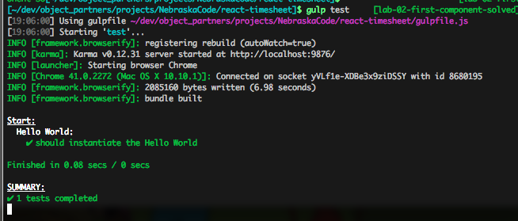
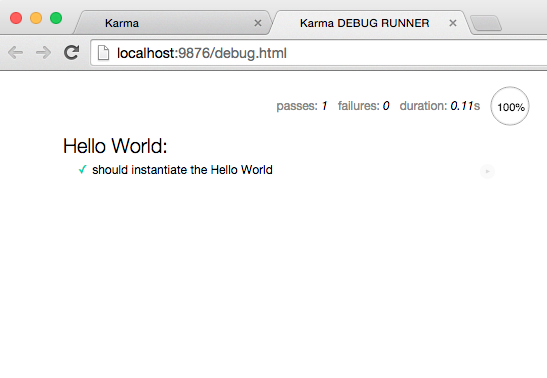
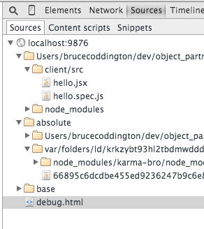
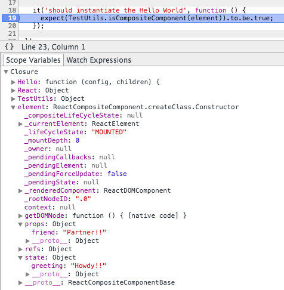
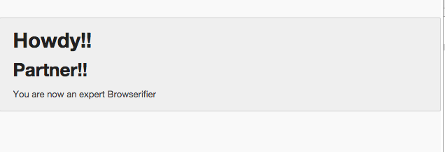

# Lab Two - Your First React Component

## Checkout the Lab Branch
- In a terminal:

```
git checkout lab-02-first-component-start
git pull
```

If not running, start the `gulp watch:dev` and `gulp serve:dev` tasks.  Otherwise, restart the running tasks to pick up any changes in the lab-02-first-component-start branch.

&nbsp;
## Create the Hello World component

- Open **client/src/hello.jsx**
- This is going to be the component that we will render to the screen.

- The first thing we want to do is `require` **React** into our **Browserify** module. At the top of the page add:

```javascript
var React = require('react/addons');
```

- Next let's create our empty **React** class and have the module `exports` the class:

```javascript
var Hello = React.createClass({

});

module.exports = Hello;
```

- Now we have to tell **React** what we want the module to draw to the page.
- To do this we need to implement a `render()` method:

- Inside the `createClass`, add the below method:

```javascript
render : function () {
  return (
    <div className="ui message">
      <div className="ui huge header">{this.state.greeting}</div>
      <div className="ui large header">{this.props.friend}</div>
      <p>You are now an expert Browserifier</p>
    </div>
  );
}
```

- Let's look at what we just did:
  - We've supplied a `JSX` template that creates a **Semantic UI** message and adds a couple of headers along with a paragraph.
  - The huge header is going to display the `greeting` value on the component's state.
  - The large header is going to display the value of the `friend` "prop" or attribute passed in by the parent component rendering this component.


- We want to initialize our component with data, so let's give the component a default state.
  - To do this we need to implement `getIntialState` which will be called by React when initializing the component.
- Add the method below to your component:

```javascript
getInitialState: function () {
  return {
    greeting: 'Howdy!!'
  };
}
```

- Now we need set the default value for the `friend` prop in case the caller doesn't include the attribute in the `JSX`.
  - To do that, we implement `getDefaultProps` which is also called by **React** during the component's initialization.

```javascript
getDefaultProps: function () {
  return {
    friend: 'Partner!!'
  };
}
```

- When complete, the entire module should look like:

```javascript
var React = require('react/addons');

var Hello = React.createClass({

  getInitialState: function () {
    return {
      greeting: 'Howdy!!'
    };
  },

  getDefaultProps: function () {
    return {
      friend: 'Partner!!'
    };
  },

  render : function () {

   return (
    <div className="ui message">
      <div className="ui huge header">{this.state.greeting}</div>
      <div className="ui large header">{this.props.friend}</div>
      <p>You are now an expert Browserifier</p>
    </div>
   );
  }
});

module.exports = Hello;

```

&nbsp;
## Test the component

- Now that we've created our first component, let's test it to make sure that React can initialize and render it to the DOM.

- Open **client/src/hello.spec.js**
- Let's set up the Hello World specification by adding a suite (describe block):


```javascript
describe('Hello World:', function () {

   var Hello,
     element,
     React,
     TestUtils;

 });

```
> We also declared the variables that we'll be using in our test.


- Next we need to initialize the libraries we'll be using by adding a `beforeEach` block. This will run before every test.

```javascript
beforeEach(function () {
  React = require('react/addons');
  TestUtils = React.addons.TestUtils;
});
```

- Now we need to set up our components that we'll be testing.
- Since we can use multiple `beforeEach` blocks, I like to use separate blocks for libraries and components.
- Add the code below to our suite:

```javascript
beforeEach(function () {
  Hello = require('./hello');
  element = TestUtils.renderIntoDocument(<Hello />);
});
```
> What is happening here? We get the **React** class, `Hello`, by injecting it into our task via **Browserify**. Next we use React's **TestUtils** to render the component into a sandboxed "document" so that we can perform inquiries. Notice that we are using `JSX` in the `TestUtils.renderIntoDocument()` method.

- Now that the component has been rendered into our test document and assigned to the `element` variable, we can perform tests on it.  Create the spec below:

```javascript
it('should instantiate the Hello World', function () {
  expect(TestUtils.isCompositeComponent(element)).to.be.true;
});
```

- Above, we just used the `TestUtils.isCompositComponent()` to determine if the `Hello` component successfully rendered to our mock document.

- When finished, your suite should look similar to the one below:

```javascript
describe('Hello World:', function () {

  var Hello,
    element,
    React,
    TestUtils;

  // Require the libraries used for testing.
  beforeEach(function () {
    React = require('react/addons');
    TestUtils = React.addons.TestUtils;
  });

  // Require the components under test.
  beforeEach(function () {
    Hello = require('./hello');
    element = TestUtils.renderIntoDocument(<Hello />);
  });

  it('should instantiate the Hello World', function () {
    expect(TestUtils.isCompositeComponent(element)).to.be.true;
  });

});

```

- If it's not already running, open your terminal and run the test (`gulp test`) command.



- Did your test pass?

- There are a couple of other tests we could perform:
  - Test that the initial state was rendered inside the element.
  - Test that the default prop was rendered inside the element.
  - We'll do more of this style testing in upcoming labs, but you can study ahead in the [React docs for TestUtils.](http://facebook.github.io/react/docs/test-utils.htm)

## Inspect the Karma Debug in Chrome

- Go to the Chrome instance that **Karma** fired up for you to run your **Mocha** test and click the **Debug** button.


- Your test should run again and **Mocha** should give you a beautiful HTML test report:



- Open Chrome Dev Tools and go to the "Sources" tab.



- You'll notice that there are a couple different representations of your application code.
  - The **Browserify** bundle (represented by a hash under the 'absolute' folder)
  - A directory structure with source maps replicating your application layout.


- **Karma** is actually running the bundle to execute your code, but you can add a breakpoint into the source maps to have the execution pause.
- Open the `hello.spec.js` in the inspector and put a break point on the line that inspects the component.
- Now refresh the page and check out the different properties that have been added by **React** and those that you've set:



&nbsp;
## Let's render Hello World to the Browser!!

- Open **client/src/main.jsx**, which is our entry point for the Browserify bundler, and tell **React** to render our component into our index.html.
  - We first need to import the **React** library and our **Hello** component.
  - We then use the `React.render()` method to place it on our page:

```javascript
var React = require('react/addons');
var Hello = require('./hello');

React.render(<Hello />, document.getElementById('app'));
```

> Note that we do not wrap this in a `module.exports` because we want this code to be executed upon interpretation in order to bootstrap our application.

&nbsp;
## Run the application and see your work.

- In a terminal windows run: `gulp watch:dev` to fire off the build.
- In a separate terminal run: `gulp serve:dev` to serve the index.html.
- Navigate to [http://localhost:3000](http://localhost:3000) in your favorite browser.



- Since we didn't set the `friend` prop on our component, the default value is displayed.
- To override it, we just add the prop as an attribute to our JSX in the render method.

```javascript
React.render(<Hello friend="WoooHooo!"/>, document.getElementById('app'));
```

- Now refresh the page. The default prop should have been overridden.


&nbsp;
### Commit your changes to Git and get ready for the next lab.

```
git add .
git commit -m 'Lab 2 completed successfully'
```
