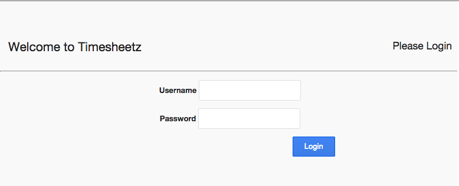
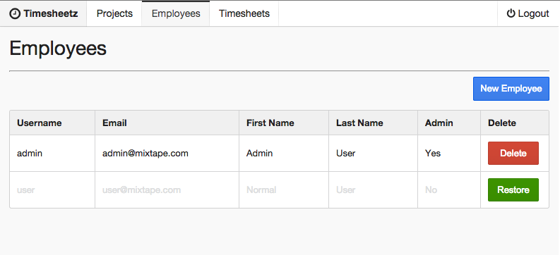
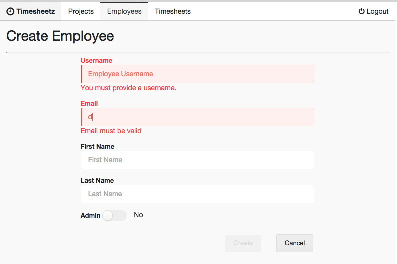

# Lab Five - Forms and Validation

## Checkout the Lab Branch

- In a terminal:

```
git checkout lab-05-forms-start
git pull
```

&nbsp;
### Check it out!

- Let's see what pull requests have been merged into our code base during the slides.
  - The biggest change is that our server team has added cookie-based security so we need to create a login form and all the flux components needed for that.
  - The file for the components needed to edit and or create an employee have been created for you, but they need to be hooked up.
  - You'll also notice that **React Router** mixins have been added to some of our previous components. More on that later.

&nbsp;
### Add the Routes for Creating and Updating

- Before we can do anything, we need to add more routes to our application and tie them together with the appropriate handlers.
- Open **client/src/routes.jsx** and add the routes below under the 'index' route:


```javascript
<Route name='login' path='/login' handler={Login} />

<Route name='app' path="/" handler={App}>

  <Route name='projects'          path='/projects'              handler={Projects} />
  <Route name='projects.detail'   path='/projects/detail/:_id'  handler={ProjectsDetail} />
  <Route name='projects.create'   path='/projects/create'       handler={ProjectsCreate} />

  <Route name='employees'         path='/employees'             handler={Employees} />
  <Route name='employees.detail'  path='/employees/detail/:_id' handler={EmployeesDetail} />
  <Route name='employees.create'  path='/employees/create'      handler={EmployeesCreate} />

  <Route name='timesheets'        path='/employees/:user_id/timesheets'             handler={Timesheets} />
  <Route name='timesheets.create' path='/employees/:user_id/timesheets/create'      handler={TimesheetsCreate} />
  <Route name='timesheets.detail' path='/employees/:user_id/timesheets/detail/:_id' handler={TimesheetsDetail} />

  <Route name='timesheets.detail.timeunits.create' path='/employees/:user_id/timesheets/detail/:_id/timeunits/create'            handler={TimeunitsCreate} />
  <Route name='timesheets.detail.timeunits.detail'   path='/employees/:user_id/timesheets/detail/:_id/timeunits/edit/:timeunit_id' handler={TimeunitsEdit} />

  <Redirect to="employees" />
</Route>
```

> Take the time to check out the path declarations and how they are adding route params, via a colon, that are dynamically replaced.


&nbsp;
### Adding Login and Logout Functionality

- The **LoginStore** and **LoginActions** classes have been implemented for you.

- Open the **LoginStore** and review the `current()` method.
  - Notice that the method returns a **Promise**
  - We can use this to effectively block (or redirect) an unauthorized user by wrapping the app bootstrap inside the resolve of the promise.
  - This is handy because it prevents the bootstrap process from running until the promise resolves without error.


- Let's implement that right now:
- Open **client/src/main.jsx**
- Add the call to the `LoginStore.current()` to our bootstrap process.

```javascript
// Attempt to get a current user session
LoginStore.current()
  .then(function () {

    // initialize the router and its routes
    Router.run(routes, function (Handler) {
      React.render(<Handler />, document.getElementById('app'));
    });
  });
```

- Another way that we can secure the application is by using **react-router**'s `willTransitionTo()` static method that it adds to components that are used as handlers.
  - The `willTransitionTo()` method is expecting a **Promise** to be returned in its implementation.
  - It will block the transition until the promise has been resolved.

- The **LoginStore** also has a `requireAuthenticatedUser()` method that returns a **Promise** that resolves upon a successful authentication.  

- Let's implement `willTransitionTo()` in our **App** component.
- Open **client/src/components/app.jsx** and add the statics array block:

```javascript
statics: {
  willTransitionTo: function (transition, params) {
    return LoginStore.requireAuthenticatedUser(transition);
  }
},
```

- Now let's test that it is working.
- Open **client/src/components/app.spec.js** and add the test:

```javascript
describe('during the will transition to lifecyle', function () {
  it('should require an authenticated user from the login store', function () {
    App.willTransitionTo('transitionArg', 'paramsArg');
    expect(proxies['../stores/login.store'].requireAuthenticatedUser).to.have.been.calledWith('transitionArg');
  });
});
```
- Run the tests and make sure it passes before moving on.

&nbsp;
## Add a Login Form Component

- Now that we have the app secured, we need to provide a way for our users to login.
- Open **client/src/components/login/login.jsx**

- Start by hooking up the **Login** component to our **LoginStore** by adding:

```javascript
store: LoginStore,

getInitialState: function () {
  return this.store.getState();
},

onChange: function () {
  this.setState(this.store.getState());
},

componentWillMount: function () {
  this.store.addChangeListener(this.onChange);
},

componentWillUnmount: function () {
  this.store.removeChangeListener(this.onChange);
},
```

- Next let's create the JSX to display a login form: (yeah..you can copy/paste this)

```javascript
render: function () {
  return (
    <div className="ui padded page grid">
      <div className="two column centered row">
        <div className="left aligned column">
          <h4>Welcome to Timesheetz</h4>
        </div>
        <div className="right aligned column">
          <h5>Please Login</h5>
        </div>
      </div>

      <hr/>

      <div className="centered row">
        <div className="center aligned eight wide column">
          <form className="ui form" name="loginForm" onSubmit={this.handleSubmit}>
            <div className="inline field">
              <label htmlFor="login">Username</label>
              <input type="text"
                name="username" ref="login"
                value={this.state.credentials.username}
                onChange={this.validate} required />
            </div>
            <div className="inline field">
              <label htmlFor="pass">Password</label>
              <input type="password"
                name="password" ref="password"
                value={this.state.credentials.password}
                onChange={this.validate} required />
            </div>
            <div className="ui right aligned column">
              <button className="ui primary login button">Login</button>
            </div>
          </form>
        </div>
      </div>
    </div>
  );
}
```

###### There are 2 items in the above JSX that I want you to notice:
1.The form is specifying to call the `handleSubmit()` callback on submit.  
```javascript
<form className="ui form" name="loginForm" onSubmit={this.handleSubmit}>
```

2. The `username` and `password` inputs are calling the `validate()` callback on change.
```javascript
onChange={this.validate}
```

- We need to implement these two callbacks.

- Since input's are controlled components they will not automatically update themselves just by having your user type into them.
- Controlled components force you to deliberately handle changes to the input. This makes it very easy to write custom validation for any of your form inputs.

- We don't really need to validate either form inputs, so we can just update our store and component state with the value:

```javascript
validate: function (event) {
  this.state.credentials[event.target.name] = event.target.value;
  this.setState(this.state.credentials);
},
```

- When the user submits the form, we just want to fire off a login action:

```javascript
handleSubmit: function (event) {
  event.preventDefault();
  LoginActions.login(this.state.credentials);
},
```

> Note that we needed to prevent the default behavior of the submit event so that our browser didn't try to do a traditional form submit. Remember this is just Javascript. **React** is not doing any magic for us under the covers to overwrite the default behavior of the browser.


&nbsp;
## Run the application and see your work.

- In a terminal windows run: `gulp watch:dev` to fire off the build.
- In a separate terminal run: `gulp serve:dev` to serve the index.html.
- Navigate to [http://localhost:3000](http://localhost:3000) in your favorite browser.

- Login with username: **Admin** and password: **password** (should have been 'guest').
- Did it work?



- Try logging in with non-sense. (You can click the link in the navbar to logout).
- Did you get an error message?

!


&nbsp;
### Add Edit Employee Functionality

- Now that we can log in to our application, let's set up a way to edit an employee.

&nbsp;
###### Before we get started, take the time to look at our custom form components already implemented for us.

- The first component we need is a form to contain all of our employee's properties.
- Open **client/src/components/employees.form.jsx**.

- This form has several more props than any component we've made so far so let's review them:
  - employee : the employee we will be editing
  - errors: an object containing validation errors
  - validate: the function to be called upon a form input value change
  - validateAll: the function to call to validate the entire form
  - hasErrors: a function that can be called to determine if any of the form inputs have validation errors
  - toggleAdmin: a helper function to toggle the boolean value of `employee.admin`
  - onSave: the callback to call when the user submits the form
  - saveText: the text of the save button

- Ok, so let's tell **React** about these props:

```javascript
propTypes: {
  employee:   React.PropTypes.object,
  errors:     React.PropTypes.object,
  validate:   React.PropTypes.func.isRequired,
  validateAll: React.PropTypes.func.isRequired,
  hasErrors:  React.PropTypes.func.isRequired,
  toggleAdmin: React.PropTypes.func,
  onSave: React.PropTypes.func.isRequired,
  saveText: React.PropTypes.string
},
```

- Next we need to act when the user clicks the cancel button.
  - To do this, we are just navigating back to the top level `employees` route.
  - We need to add the **Router.Navigation** mixin to our component so that we have access to the `transitionTo()` method.

```javascript
mixins: [
  Router.Navigation
],

onCancel: function (event) {
  event.preventDefault();
  this.transitionTo('employees');
},
```

- Now it's time to draw our `render()` method with the JSX to build the form:

```javascript
render : function () {
  return (
    <div className="ui ten column centered grid">
      <div className="ten wide column">
        <form className="ui inline form" name="employeeForm" onSubmit={this.props.onSave}>

          <TextInput name="username"
            label="Username"
            placeholder="Employee Username"
            value={this.props.employee.username}
            error={this.props.errors.username}
            onChange={this.props.validate} />

          <TextInput name="email"
            label="Email"
            placeholder="Employee Email"
            value={this.props.employee.email}
            error={this.props.errors.email}
            onChange={this.props.validate} />

          <TextInput name="firstName"
            label="First Name"
            placeholder="First Name"
            value={this.props.employee.firstName}
            error={this.props.errors.firstName}
            onChange={this.props.validate} />

          <TextInput name="lastName"
            label="Last Name"
            placeholder="Last Name"
            value={this.props.employee.lastName}
            error={this.props.errors.lastName}
            onChange={this.props.validate} />

          <Checkbox name="admin"
            label="Admin"
            value={this.props.employee.admin}
            onClick={this.props.toggleAdmin}
            onChange={this.props.validate} />

          <div className="ui horizontal divider"></div>

          <div className="ui sixteen column right floated grid">
            <SaveButton validateAll={this.props.validateAll} hasErrors={this.props.hasErrors()} saveText={this.props.saveText} />
            <CancelButton onCancel={this.onCancel} />
          </div>
        </form>
      </div>
    </div>
  );
}
```

> Notice that we are not actually implementing the save function. That is left for the component that uses this form to implement and pass it in as a prop.

- Time to test the form.
- For time's sake, we'll just test the functionality of the cancel button, because it will highlight some more coolness of **TestUtils**.

- Open **client/src/components/employees.form.spec.js**.

- Test the cancel button by:
  - Getting the cancel button component out of the virtual DOM.
  - Getting the actual HTML button out of the cancel button component.
  - Telling **TestUtils** to simulate a click on that button.
  - Testing that the `transitionTo` method was called as a result.


```javascript
describe('clicking the cancel button', function () {
  it('should go back to the employees home', function () {
    var cancel = TestUtils.findRenderedComponentWithType(element, CancelButton);
    var button = TestUtils.findRenderedDOMComponentWithTag(cancel, 'button');
    TestUtils.Simulate.click(button);

    expect(spies.transitionTo).to.have.been.calledWith('employees');
  });
});
```

- Run the tests and validate it passes before going to the next section.

&nbsp;
## Add the Form into an Employee Detail Component

- Now let's actually USE the form we just built.

- Before we get started, an **EmployeeMixin** with basic form validation has been implemented for you.
  - Open **client/src/mixins/employee.mixin.js** and look at what all is in there:
    - Attaching the **EmployeeStore** to the component.
    - `validate()` `validateAll()` `hasErrors()` and `toggleAdmin()` method implementations.
    - Basic validation for our form


- Open **client/src/components/employee.detail.jsx**

- Add the following mixins:
  - **Router.Navigation** gives us access to the `transitionTo()` method.
  - **Router.State** give us access to the `getParams()` method
  - **EmployeeMixin** is the


```javascript
mixins: [
  Router.Navigation,
  Router.State,
  EmployeeMixin
],
```

- Next let's provide a default state for the component:

```javascript
getInitialState: function () {
  return {
    saveText: 'Update',
    employee: {},
    errors: {}
  };
},
```

- The next step is hook our component up to our Flux architecture.
  -

```javascript
onChange: function () {
  this.setState(this.store.getState());
},

componentWillMount: function () {
  this.store.addChangeListener(this.onChange);
},

componentWillUnmount: function () {
  this.store.removeChangeListener(this.onChange);
},
```

- If the user refreshes the page or navigates directly to the employee edit route, we need to go get the employee from our REST service.

- We'll use the `componentDidMount` lifecycle event to make this call so that the store's listeners have been registered.

```javascript
componentDidMount: function () {
  this.get();
},

get: function () {
  // get the employee from the store
  var employee = this.store.getState().employee;

  // if there isn't an employee in the store
  if (_.isEmpty(employee)) {

    // get the id from the url for this route and fire the action
    var employeeId = this.getParams()._id;
    EmployeeActions.get(employeeId);
  }
  else {
    // manually call the onChange method so that the component knows to update itself
    this.onChange();
  }
},
```

- We need to provide the **EmployeeForm** with a callback to apply when the save button is clicked.
  - We will first validate the entire form to make sure no input has validation errors.
  - If there are no errors, we fire the update action and transition back to the `employees` route.

```javascript
saveEmployee: function (event) {
  event.preventDefault();
  this.validateAll();

  if (!this.hasErrors()) {
    EmployeeActions.update(this.state.employee);
    this.transitionTo('employees');
  }
},

```

- Finally we just need to use the form and pass it all of the props it is expecting in our `render()` method.

```javascript
render : function () {
  return (
    <EmployeeForm employee={this.state.employee}
      errors={this.state.errors}
      validateAll={this.validateAll}
      hasErrors={this.hasErrors}
      saveText={this.state.saveText}
      onSave={this.saveEmployee}
      validate={this.validate}
      toggleAdmin={this.toggleAdmin} />
  );
}
```

&nbsp;
## Test the Employee Detail Component

- Open **client/src/components/employee.detail.spec.js** and add the following tests:

```javascript
describe('getting the employee', function () {
  describe('and the employee exists on the store state', function () {
    beforeEach(function () {
      element.store.state.employee = {_id: 'abc123'};
      element.get();
    });

    it('should set the employee on the component state', function () {
      expect(element.state.employee._id).to.equal('abc123');
    });
  });

  describe('and the employee does NOT exist in the stored state', function () {
    beforeEach(function () {
      element.get();
    });

    it('should fire a get employee action', function () {
      expect(proxies['../../actions/employee.actions'].get).to.have.been.calledWith('abc123');
    });
  });
});

describe('saving an employee', function () {
  beforeEach(function () {
    element.saveEmployee({preventDefault: _.noop});
  });

  it('should validate the entire employee', function () {
    expect(spies.validateAll).to.have.been.called;
  });

  describe('and the employee passes validation', function () {
    beforeEach(function () {
      spies.hasErrors = sinon.stub(element, 'hasErrors').returns(false);
    });

    afterEach(function () {
      spies.hasErrors.restore();
    });

    it('should fire an update action', function () {
      expect(proxies['../../actions/employee.actions'].update).to.have.been.called;
    });

    it('should transition back to the employee list', function () {
      expect(spies.transitionTo).to.have.been.calledWith('employees');
    });
  });
});
```

- Run the tests and verify that they pass before moving on to the next section.


- We've got an Employee Detail route, but don't have a way to get to it yet.
- We're going to make it so that when you click an **EmployeeRow** we navigate to the appropriate detail route for that employee.


- Open **client/src/components/employees/employee.row.jsx**

- Add the `showDetail()` method to the **EmployeeRow**

```javascript
showDetail: function showDetail () {
  var employee = this.props.employee;
  if (employee.deleted) {
    console.log('You cannot edit a deleted employee.');
    return;
  }
  this.props.store.setState({employee: employee});
  this.transitionTo('employees.detail', {_id: employee._id});
},
```

- Now add an `onClick()` handler to the `<tr/>` in the `render()` method.

```javascript
<tr className={classNames} ref={employee._id} onClick={this.showDetail}>
```

- Let's test that clicking the row actually navigates where it is supposed to:

- Open **client/src/components/employees/employee.row.spec.js**
- Add the following tests:

```javascript
describe('clicking the row', function () {
  describe('when the employee is deleted', function () {
    beforeEach(function () {
      employee = {
        _id: 'abc123',
        deleted: true
      };

      spies.error = sinon.stub(SnackbarActions, 'error');

      element = TestUtils.renderIntoDocument(<EmployeeRow employee={employee} store={EmployeeStore} />);
      element.showDetail();
    });

    afterEach(function () {
      spies.error.restore();
    });

    it('should display an error in the snackbar', function () {
      expect(spies.error).to.have.been.calledWith('You cannot edit a deleted employee.');
    });
  });

  describe('when the employee is NOT deleted', function () {
    beforeEach(function () {
      employee = {
        _id: 'abc123',
        username: 'sterlingArcher',
        deleted: false
      };

      element = TestUtils.renderIntoDocument(<EmployeeRow employee={employee} store={EmployeeStore} />);
      spies.transitionTo = sinon.stub(element, 'transitionTo');
      element.showDetail();
    });

    afterEach(function () {
      spies.transitionTo.restore();
    });

    it('should set the employee on the stored state', function () {
      expect(element.props.store.getState().employee.username).to.equal('sterlingArcher');
    });

    it('should transition to the detail route', function () {
      expect(spies.transitionTo).to.have.been.calledWith('employees.detail', {_id: 'abc123'});
    });
  });
});
```

- Run the tests and verify that they pass before moving to the next section.
  - You'll have to uncomment the spies for them to work.

&nbsp;
## Run the application and see your work.

- In a terminal windows run: `gulp watch:dev` to fire off the build.
- In a separate terminal run: `gulp serve:dev` to serve the index.html.
- Navigate to [http://localhost:3000](http://localhost:3000) in your favorite browser.

- Try navigating to an employee detail by clicking on a row in the table and editing the employee. Did it save correctly?


&nbsp;
## Add the Ability to Create an Employee

- Open **client/src/components/employees.create.jsx**
- Following the same steps you did for the **EmployeeDetail** component, implement and test the **EmployeeCreate** component.

```javascript
mixins : [
  Router.Navigation,
  Router.State,
  EmployeeMixin
],

onChange: function () {
  this.setState(this.store.getState());
},

componentWillMount: function () {
  this.store.addChangeListener(this.onChange);
},

componentWillUnmount: function () {
  this.store.removeChangeListener(this.onChange);
},

getInitialState: function () {
  return {
    saveText: 'Create',
    employee: {
      admin:false
    },
    errors: {}
  };
},

saveEmployee: function (event) {
  event.preventDefault();
  this.validateAll();

  if (!this.hasErrors()) {
    EmployeeActions.create(this.state.employee);
    this.transitionTo('employees');
  }
},

render : function () {
  return (
    <EmployeeForm employee={this.state.employee}
      errors={this.state.errors}
      validateAll={this.validateAll}
      hasErrors={this.hasErrors}
      saveText={this.state.saveText}
      onSave={this.saveEmployee}
      validate={this.validate}
      toggleAdmin={this.toggleAdmin} />
  );
}
```

- Now test it!!
- Open **client/src/components/employees.create.spec.js** and add the tests.
  - You'll have to uncomment the spies for them to work.

```javascript
describe('saving an employee', function () {
  beforeEach(function () {
    element.saveEmployee({preventDefault: _.noop});
  });

  it('should validate the entire employee', function () {
    expect(spies.validateAll).to.have.been.called;
  });

  describe('when the employee passes validation', function () {
    beforeEach(function () {
      spies.hasErrors = sinon.stub(element, 'hasErrors').returns(false);
    });

    afterEach(function () {
      spies.hasErrors.restore();
    });

    it('should fire a create action', function () {
      expect(spies.create).to.have.been.called;
    });

    it('should transition back to the employee list', function () {
      expect(spies.transitionTo).to.have.been.calledWith('employees');
    });
  });
});
```

- We need a way to get there, so let's add a button in the **Employees** component to navigate us to the create employee route.

- Open **client/src/components/employees.jsx**

- Add the callback to navigate to the `employee.create` route:

```javascript
  createNew: function createNew () {
    this.transitionTo('employees.create');
  },
```


- In the `render()` method add the button below in place of the comment:

```javascript
<div className="row">
  <button className="ui right floated primary button pad-bottom" type="button" onClick={this.createNew}>
    New Employee
  </button>
</div>
```

- And then, of courcse, test it:

- In **client/src/components/employees.spec.js** add:

```javascript
describe('clicking the new employee button', function () {
  it('should transition to the create employee route', function () {
    var button = TestUtils.findRenderedDOMComponentWithTag(element, 'button');
    TestUtils.Simulate.click(button);
    expect(spies.transitionTo).to.have.been.calledWith('employees.create');
  });
});
```

- Run the tests and watch them pass.

&nbsp;
## Run the application and see your work.

- In a terminal windows run: `gulp watch:dev` to fire off the build.
- In a separate terminal run: `gulp serve:dev` to serve the index.html.
- Navigate to [http://localhost:3000](http://localhost:3000) in your favorite browser.

- Click the create employee button.



- Attempt to create an employee. Did you get any validation errors?




&nbsp;
### Commit your changes to Git and get ready for the next lab.

```
git add .
git commit -m 'We are validating forms'
```
